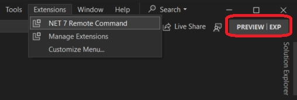
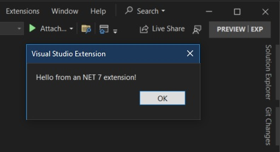

## Ref

1. https://learn.microsoft.com/en-us/visualstudio/extensibility/visualstudio.extensibility/get-started/create-your-first-extension

2. The new Visual Studio Extension system. This is currently in Preview
    1. https://github.com/microsoft/VSExtensibility/
    2. https://devblogs.microsoft.com/visualstudio/visualstudio-extensibility-preview-3/
    3. https://marketplace.visualstudio.com/items?itemName=vsext.gladstone

## How this project is built. This is based on the first ref.

1. First get equipped with the requirements.
   1. https://github.com/microsoft/VSExtensibility/#install-visualstudioextensibility
   2. https://marketplace.visualstudio.com/items?itemName=vsext.gladstone
   3. https://learn.microsoft.com/en-us/visualstudio/releases/2022/release-notes-preview#1780-pre10--visual-studio-2022-version-178-preview-1 

2. Visual Studio 2022 version 17.8 Preview 1 or higher is needed, as [mentioned here.](https://github.com/microsoft/VSExtensibility/#install-visualstudioextensibility)

3. Install [VisualStudio.Extensibility Project System extension](https://marketplace.visualstudio.com/items?itemName=vsext.gladstone)

4. Follow the steps in [the above top ref](https://learn.microsoft.com/en-us/visualstudio/extensibility/visualstudio.extensibility/get-started/create-your-first-extension).

5. Changed the project TargetFramework to target to the latest version, from net6.0 to net7.0
```xml
<PropertyGroup>
  <TargetFramework>net7.0-windows</TargetFramework>
  ...
</PropertyGroup>
```
6. Reset preview exp instance
   1. 

7. Build and Run.
   1. 

8. Execute the command
   1. 

9. Now how to pack this to a vsix. Not sure. Need to find out.

10. https://github.com/microsoft/VSExtensibility/issues/258

