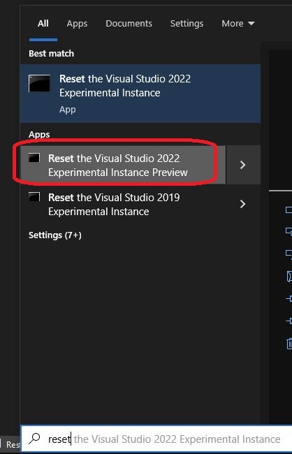
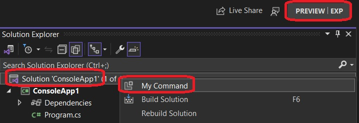
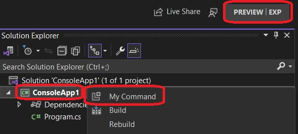
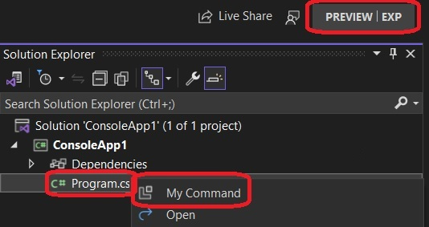
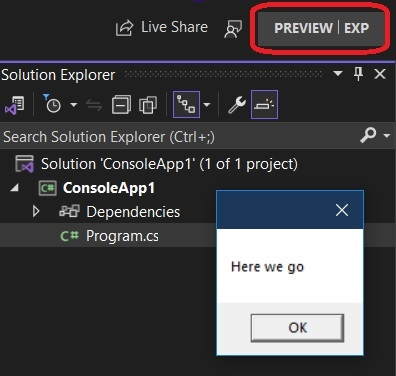

## Ref

1. https://github.com/microsoft/VSExtensibility/tree/main/New_Extensibility_Model/Samples/CommandParentingSample

## How this project is built. This is based on the first ref.

1. First get equipped with the requirements.
   1. https://github.com/microsoft/VSExtensibility/#install-visualstudioextensibility
   2. https://marketplace.visualstudio.com/items?itemName=vsext.gladstone
   3. https://learn.microsoft.com/en-us/visualstudio/releases/2022/release-notes-preview#1780-pre10--visual-studio-2022-version-178-preview-1 

2. Visual Studio 2022 version 17.8 Preview 1 or higher is needed, as [mentioned here.](https://github.com/microsoft/VSExtensibility/#install-visualstudioextensibility)

3. Install [VisualStudio.Extensibility Project System extension](https://marketplace.visualstudio.com/items?itemName=vsext.gladstone)

4. Name the command file and class as SampleCommand

5. Modify the ExecuteCommandAsync method as follows.

```cs
public override Task ExecuteCommandAsync(IClientContext context, CancellationToken cancellationToken)
{
    // await context.ShowPromptAsync("Hello from an extension!", PromptOptions.OK, cancellationToken);
    MessageBox.Show("Here we go");
    return Task.CompletedTask;
}
```

6. The CommandConfiguration Property to be modified as follows.

```cs
public override CommandConfiguration CommandConfiguration => new("%CommandParentingSample.SampleCommand.DisplayName%")
{
    // Use this object initializer to set optional parameters for the command. The required parameter,
    // displayName, is set above. DisplayName is localized and references an entry in .vsextension\string-resources.json.
    Icon = new(ImageMoniker.KnownValues.Extension, IconSettings.IconAndText),
    // Placements = new[] { CommandPlacement.KnownPlacements.ExtensionsMenu },
    Placements = new[]
    {
		// File in project context menu
		CommandPlacement.FromVsctParent(new Guid("{d309f791-903f-11d0-9efc-00a0c911004f}"), 521),

		// Project context menu
		CommandPlacement.FromVsctParent(new Guid("{d309f791-903f-11d0-9efc-00a0c911004f}"), 518),

		// Solution context menu
		CommandPlacement.FromVsctParent(new Guid("{d309f791-903f-11d0-9efc-00a0c911004f}"), 537),
    },
};
```

The guid **d309f791-903f-11d0-9efc-00a0c911004f** cannot be changed. I am not sure why. If changed, then the menu is not created as expected. Next the 521, 518, and 537 numbers present as the second parameter are also important. If you change those numbers, then again the context menus are not created as expected. Need to find out why.


7.  Reset preview exp instance



8. Build and Run as usual.

9.  Now open any solution which has projects and files. 

10.  Watch first the context menu of solution explorer.



11. Next the context menu in project of solution explorer.



12.  Finally an item in the project of solution explorer.



13. Execute the command from any of the context menus above. You will see a message box.



14. Raised the following issue. Not clear 
    1.  https://github.com/microsoft/VSExtensibility/issues/260

15.   
